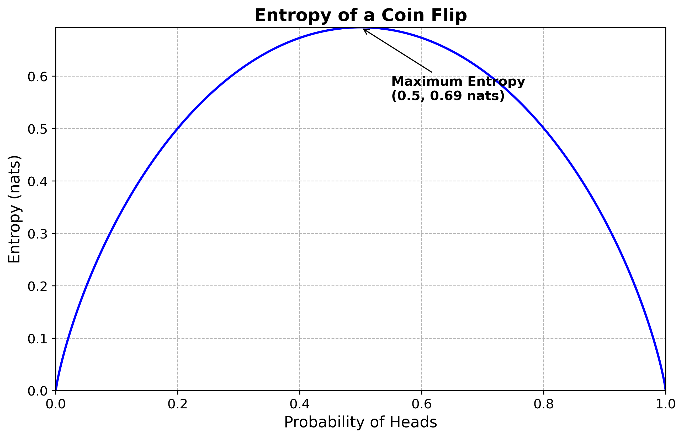

# Soft Actor-Critic Methods

Soft Actor-Critic methods are a type of reinforcement learning algorithms that hold a special spot in my heart. I remember the excited, and slightly sinking, feeling of "wow, physics really is ubiquitous" when I heard that entropy was used as guiding metric for agents to learn how to play games.

SAC methods was also the first big reinforcement learning project I undertook from just reading the paper and without having an identical project to reference against use to check my answers. It was therefore the first one I had to spend hours twiddling hyper-parameters and checking for bugs. I eventually ended up with quite well commented code, a working test set and a pretty good understanding of soft actor-critic. This is therefore what I am going to go through today.

## Overview

### What's an actor-critic?

You can think of actor-critic methods as like a newbie player training with their new coach. The player attempts to make a play and the coach tells them whether it was any good or not. If it was, the player will be more likely to make that play again. If not, less likely.

In the case of actor critic, the player is a neural network which is learning to map states to good actions and the critic is another neural network learning to score how good these are. 

### What's so soft about soft actor-critic?

Soft actor-critic is 'soft' as it looks to maxmimise entropy as well as reward in its policy's objective function. This is 'soft' as the actor may be encouraged to choose a slightly smaller expected reward path, as long as it is more entropic.

### Why entropy?

Shannon's entropy is the measure of uncertainty in a probability distribution. The Shannon entropy is given by 

$$H(X) = -\sum_{i} P(x_i) \log P(x_i)$$

- $P(x)$ is a probability, so it satisfies the condition: $0 \leq P(x) \leq 1$.

- The sum of all probabilities $P(x)$ over all possible outcomes $ x $ must equal 1 $\sum_{i} P(x_i) = 1$

$P(x)$ is positive but less than 1. $\log P(x)$ will therefore be negative and asymptotic at $\lim_{P(x) \to 0} -\log(P(x)) = \infty$. However, as the values have to sum to 1, overall entropy is highest when the probability is spreadout (i.e. it is unpredictable).

A simple example is a coin flip. If $P(Heads) = x$ then $P(Tails) = 1 - x$. Entropy therefore is $H = -x \log(x) - (1-x) \log(1-x)$. The entropy of the coin flip with different probabilities of heads is plotted below. As you can see, entropy is highest at $P(Heads) = 0.5$, when the coin is least predictable.

This can be modified for continuous distribution by simply changing the sum to an integral and the probability to probability density.

$H(X) = -\int_{-\infty}^{\infty} p(x) \log p(x) \, dx$

*Figure: Entropy of a coin flip*

### How can a policy have a high entropy?

Soft actor-critic uses a stochastic policy which generates means and standard deviations and then samples from the corresponding normal distribution. Every possible action will have an accompanying probability distribution which we can plug into the equation above. At each state the entropy will be: 

$H(\pi(s)) = -\int_{A} \pi(a \mid s) \log \pi(a \mid s) \, da$

Note: $\pi(a \mid s)$  means the probabilty of doing action $a$ in state $s$.

In our case $\pi(a \mid s)$ is a normal distribution. If you plug its probability density equation into the entropy formula you will get:

$H(X) = \frac{1}{2} \log(2\pi e \sigma^2)$

This makes sense. Higher standard deviations (more variance) means higher unpredictability of the policy.

### Why would we want a policy to have high entropy?

The benefits of a policy being slightly unpredictable falls into the main two categories.

1. Exploration:
   - Avoid premature convergence and encourage exploration. Encouraging randomness allows you to explore more actions and states, even if a certain policy looks very promising early on.
  
2. Robustness:
   - Encourages multiple optimal policies to be learnt. Agent won't over commit to certain policies.
   - This can be very important in partially observed states in which multiple states may appear the same to the agent.
  

## Implementation

This implementation has four neural networks. Below is a brief description of what each one is approximating, what it is used for here and how it is optimised. 

### Critic 

This neural networks is used to provide a value estimate of the action the actor has taken in a specific state. It does this by approximating the Q-function which does exactly that. It is updated using a temporal error loss which takes the error between tehe predicted and bootstrapped, observed error.

